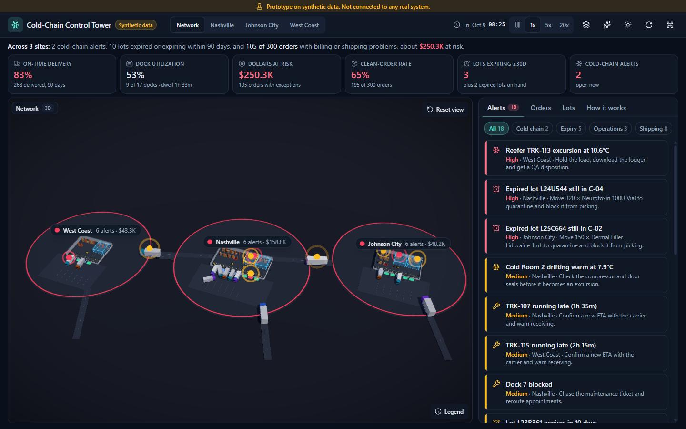
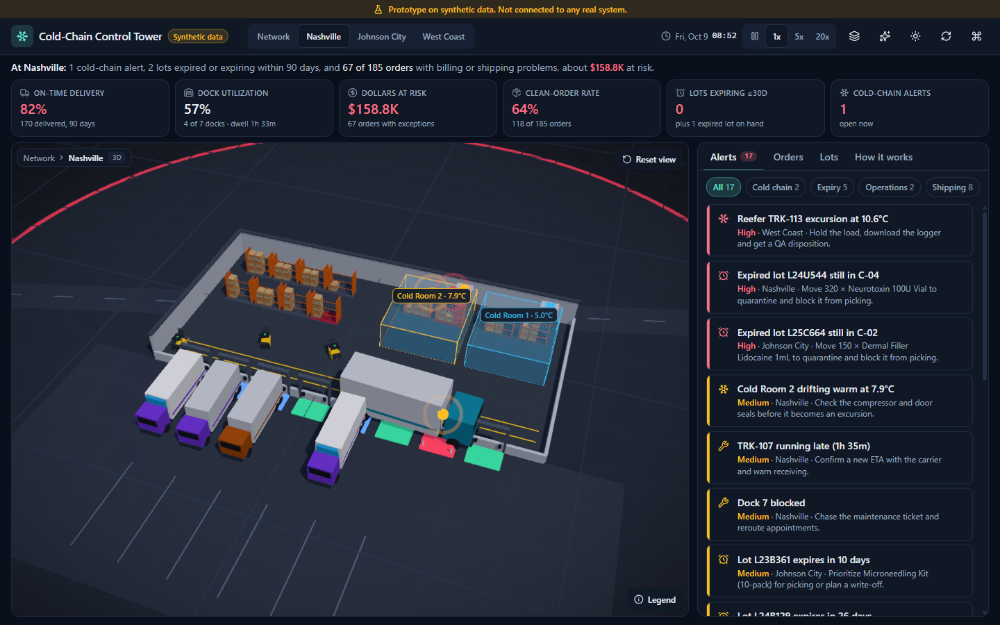
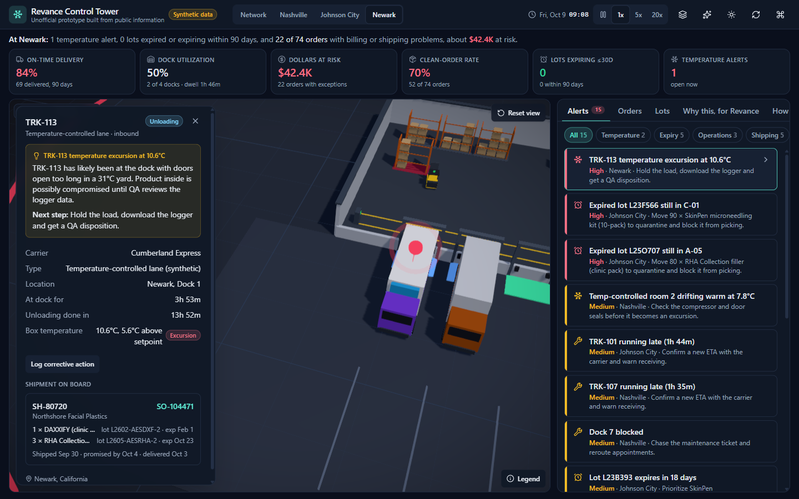
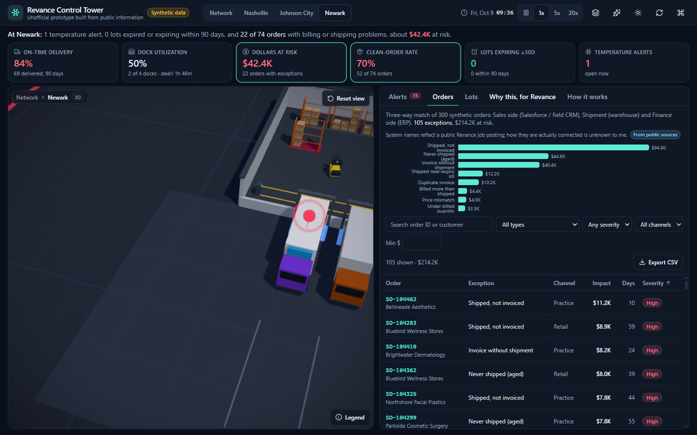
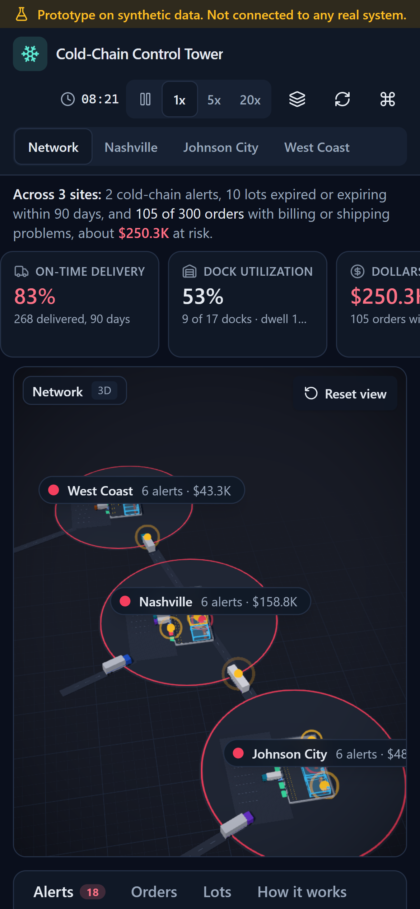

# Revance Control Tower

**Unofficial prototype built from public information.** Not affiliated with or endorsed by Revance. All data is synthetic, and it is not connected to any real system.

A 3D supply-chain control tower across three sites, running entirely in the browser on **synthetic data**. It looks like a strategy game; underneath it is an ordinary data model (sites, docks, trucks, stock, orders, shipments, invoices) with a tested engine that finds operational problems:

- temperature excursions on temperature-controlled lanes and in temperature-controlled rooms (a generic, synthetic scenario)
- expired and soon-to-expire lots still on the shelf
- late trucks, blocked docks and low forklift batteries
- order-to-cash breaks between the sales side, the warehouse and finance: shipped but not invoiced, price and quantity mismatches, duplicate invoices, and more

> Unofficial prototype. Not affiliated with or endorsed by Revance. Synthetic data. Not connected to any real system.



| Site view                              | Temperature alert detail                       | Orders panel                             |
| -------------------------------------- | ---------------------------------------------- | ---------------------------------------- |
|  |  |  |

Phone: 

A backup recording of the happy path is in [`docs/demo.webm`](docs/demo.webm).

## What is public and what is made up

Only the items marked "From public sources" in the app come from public information, and they are used as plain text only: no logos, brand colors, imagery or marketing text.

| From public sources                                                                                                                                                       | Synthetic (invented)                                           |
| ------------------------------------------------------------------------------------------------------------------------------------------------------------------------- | -------------------------------------------------------------- |
| Site locations and roles: Nashville (headquarters, distribution), Johnson City, Tennessee (manufacturing and operations), Newark, California (R&D and regional)           | Site layouts, docks, equipment, trucks, carriers, temperatures |
| Product names: DAXXIFY and RHA Collection fillers (RHA distributed in the US via a partner); SkinPen microneedling kits; PanOxyl, Blue Lizard, StriVectin, BIOJUVE, Sarna | SKUs, pack variants, prices, lots, shelf lives, stock levels   |
| System names from a public job posting: Salesforce / field CRM (sales side), warehouse (shipment), ERP (finance side). How they are actually connected is unknown.        | Customers, orders, shipments, invoices and every dollar figure |
| Public priorities as read from public material (shown in the "Why this, for Revance" tab)                                                                                 | All alerts, KPIs and explanations                              |

The app makes no clinical or efficacy claims about any product and does not say which products need refrigeration. Temperature monitoring is a generic scenario: lots are placed in temperature-controlled zones at random. "Which of your products are actually temperature-controlled in transit?" is one of the open questions.

## The story

Every generated world starts with something worth finding: a temperature-controlled truck with an excursion in a hot synthetic yard at Newark, a temperature-controlled room drifting warm, expired lots still in pickable bays, two late trucks, a blocked dock and about a third of orders with a mismatch between the sales side, the warehouse and finance.

## Run it

```bash
npm install
npm run dev          # http://localhost:5173
```

| Command                                          | What it does                                                                             |
| ------------------------------------------------ | ---------------------------------------------------------------------------------------- |
| `npm run dev`                                    | Dev server                                                                               |
| `npm run build`                                  | Typecheck and production build to `dist/`                                                |
| `npm run preview`                                | Serve the production build on port 4173                                                  |
| `npm test`                                       | Unit tests (Vitest) for the generator, simulation and engine                             |
| `npm run e2e`                                    | Playwright end-to-end suite, **headed** with slowMo 150 ms, on phone, tablet and desktop |
| `npm run e2e:ci`                                 | Same suite, headless                                                                     |
| `npm run e2e:media`                              | Regenerates `docs/screenshots/*` and `docs/demo.webm` (headed)                           |
| `npm run lint` / `typecheck` / `format` / `knip` | ESLint, `tsc` strict, Prettier, unused-code check                                        |
| `npm run analyze`                                | Bundle treemap (`stats.html`) via rollup-plugin-visualizer                               |
| `npm run verify`                                 | lint, typecheck, unit tests, build and the headless e2e suite                            |

Useful URL flags: `?seed=7` (different world), `?speed=0|1|5|20`, `?view=2d`, `?webgl=0` (simulate a device without WebGL), `?perf=off` (disable the slow-device check), and `?leva=1` in dev for the leva tuning panel.

Keyboard: `Ctrl/Cmd + K` opens the command palette to jump to any site, truck, dock, temperature-controlled room, lot, order or alert.

## Showing it (local only, do not publish)

Do not publish this version to a public URL. A public link that carries the company's name should not be shared. It is meant to be shown from your own laptop or phone.

- **Laptop:** `npm run dev`, then open <http://localhost:5173>. For the production build: `npm run build && npm run preview`, then open <http://localhost:4173>.
- **Your phone on the same Wi-Fi:** `npm run build && npm run preview -- --host`. Vite prints a `Network:` address such as `http://192.168.x.x:4173`; open it on your phone. If Windows Firewall asks, allow Node.js on private networks only. Stop the server when you are done.
- **Offline backup:** play `docs/demo.webm`.

The page carries `noindex, nofollow`, and the deploy configs for public hosting were removed from this version.

## Architecture

The 3D scene is a view, not the model. A clean data and engine layer comes first; the 3D scene and the 2D fallback are interchangeable views on top of it.

```
src/
  sim/      types.ts, prng.ts (mulberry32), products.ts, world.ts (generator), tick.ts (simulation step), lookup.ts
  engine/   reconcile.ts, alerts.ts, kpis.ts, expiry.ts, coldchain.ts, explain.ts  (pure, unit tested)
  store/    useWorld.ts (zustand: world, clock speed, selection, view), derived.ts (memoized selectors)
  scene/    Scene.tsx (R3F canvas), Site3D, Dock3D, Truck3D, Forklift3D, StockBay3D, Ground, CameraRig,
            Labels (alert markers), ScreenLabels (DOM labels), Effects, Fallback2D (SVG), layout.ts (shared geometry)
  ui/       TopBar, KpiStrip, Headline, AlertFeed, DetailPanel, OrdersPanel, LotsPanel, HowItWorks, CommandPalette, …
tests/      Vitest unit tests
e2e/        Playwright end-to-end, accessibility, performance and media specs
```

`scene/layout.ts` is pure: it maps every object to a position. The 3D scene and the SVG fallback both use it, so they always agree, and the e2e tests use it to find objects on screen.

### Data model

`Site → Dock, StockBay → Lot, ColdRoom, Truck, Forklift`; `Order → Shipment (lines with lot IDs) → Invoice`; plus a `lotCatalog` of every lot ever produced (shipments reference lots that are no longer in stock). The full types are in `src/sim/types.ts`. A few fields go beyond the brief: trucks carry `location`, `direction`, `tripMinutes`, `delayMinutes` and `taskMinutes` so the simulation can move them; temperature-controlled rooms (`ColdRoom` in code) carry a `biasC` (a failing compressor) and a 12-hour `history`; orders carry a `fulfillmentSite` so KPIs can be split by site.

### Synthetic world

`generateWorld(seed = 42, today)` uses its own mulberry32 PRNG, never `Math.random`. Same seed and same date, same world. All dates are relative to today.

- 15 trucks (6 on temperature-controlled lanes), 6 forklifts, 5 temperature-controlled rooms, 26 bays, 46 to 54 lots, 300 orders over 90 days.
- Lots: 1 or 2 expired with stock on hand, 3 or 4 expiring within 30 days, 8 to 10 within 90 days in total.
- Problems: 1 temperature-controlled room in warning, 1 truck temperature excursion, 2 late trucks (plus a yard queue), 1 blocked dock, 1 forklift on low battery.
- Orders: 9% shipped not invoiced, 7% price mismatch, 7% quantity mismatch (4% under-billed, 3% over-billed), 4% invoice without shipment, 4% never shipped and aged, 3% shipped from an expired or near-expiry lot, 1% duplicate invoice; the rest clean (with some normal short shipments that lower the fill rate).

### Simulation

`tick(world, minutes)` is pure and steps one simulated minute at a time, so `tick(w, a + b)` equals `tick(tick(w, a), b)`. At 1x, one real second is 5 simulated minutes (pause, 1x, 5x and 20x in the top bar).

- Trucks count down their ETA, take a free dock of the right type (inbound or outbound) or wait in the yard (shown as delayed), load or unload for 40 to 110 minutes, pull out and drive to another site. About 12% of new trips run late.
- Forklifts shuttle between bays and active docks, drain battery, and go to the charger at 12%.
- Temperature-controlled rooms drift toward setpoint plus equipment bias, with sensor noise; readings are kept every 15 minutes.
- Temperature-controlled trucks (`kind: "reefer"` in code) at a dock for more than 90 minutes in a yard at 28°C or hotter start warming.
- Excursions are latched until someone clicks **Log corrective action**. A blocked dock can be marked repaired.

Travel times are compressed (Nashville to Johnson City is 3 simulated hours) so trips finish within a demo. Order, invoice and lot dates stay anchored to today's date while the operational clock runs.

### Matching rules (`engine/reconcile.ts`)

One exception per order and type; line-level dollars are summed into it, so nothing is double counted.

| Exception                              | Rule                                                                   | Dollar impact                                  |
| -------------------------------------- | ---------------------------------------------------------------------- | ---------------------------------------------- |
| Shipped, not invoiced                  | Shipped at least 2 days ago, no invoice                                | shipped qty × order price                      |
| Price mismatch                         | Invoice price differs from order price                                 | \|invoice price − order price\| × invoiced qty |
| Under-billed quantity (`QTY_MISMATCH`) | Invoiced fewer units than shipped                                      | \|invoiced − shipped\| × order price           |
| Billed more than shipped               | Invoiced more units than shipped                                       | (invoiced − shipped) × invoice price           |
| Invoice without shipment               | Invoice exists, nothing shipped                                        | invoice total                                  |
| Never shipped (aged)                   | Order older than 7 days, nothing shipped or invoiced                   | order total                                    |
| Expiry-risk shipment                   | A shipped lot was expired or within 30 days of expiry on the ship date | shipped qty × order price                      |
| Duplicate invoice                      | A later invoice repeats an earlier one line for line                   | duplicate invoice total                        |

Severity: **high** at $5,000 or more, or more than 30 days open; **medium** at $1,000 or more, or more than 14 days; otherwise **low**.

Quantity mismatches split by direction: under-billing is `QTY_MISMATCH` and over-billing is `BILLED_MORE_THAN_SHIPPED`, so the same units are never counted twice. The invoice compared is the earliest one; later identical invoices are duplicates.

### Other engine rules

- **Expiry:** expired if past the expiry date, critical at 30 days or fewer (including today), warning at 90 days or fewer.
- **Temperature:** synthetic setpoint 5°C. Warning at 2°C or more off setpoint, excursion at 4°C or more, in either direction, rounded to 0.01°C.
- **Alerts:** cold excursions and warnings, expired lots, lots expiring within 30 days, trucks more than 60 minutes late, blocked docks, forklift battery under 15%, and shipments past their promise date (last 14 days; older ones live in the Orders tab). Each has a severity, a site, an object reference (clicking flies the camera there) and a next step.
- **Explanations:** rules-based templates, at most two sentences, always hedged ("likely", "possibly"), each with a next step. There is no AI call; nothing leaves the browser.
- **KPIs:** on-time delivery, average dock dwell (last 50 visits), dock utilization (occupied over non-blocked docks), fill rate, stock value by site, dollars at risk, clean-order rate. All split by site when a site is selected.

## 3D and fallback

- React Three Fiber, drei and postprocessing. Every object is procedural geometry: no models, textures, HDRs or fonts are downloaded.
- Decorative boxes (walls, door frames, chassis, road markings), lamps and wheels are three shared instanced batches; pallets and racks are instanced per site. A network frame is about 100 draw calls.
- Hover outlines, click-to-select, a smooth camera fly-to (an arc with easing) and pulsing alert markers with subtle bloom.
- Orbit limits keep the camera above ground. On phones, one finger orbits and two fingers pan and zoom; in portrait the network view turns so the three sites stack vertically.
- `frameloop="demand"` while paused, pixel ratio capped at 2, and smaller shadow maps on touch devices.
- **Low graphics** (sparkles icon) turns off shadows, fog, the grid and post-processing.
- **Automatic fallback:** without WebGL, or if the 3D view crashes, the app shows the SVG 2D map, which has the same objects, colors and clicks. A frame-time watchdog first drops to low graphics, then to 2D if frames still average over 40 ms. A toggle in the top bar switches between 3D and 2D at any time.
- **Reduced motion:** with `prefers-reduced-motion`, camera moves snap, vehicles jump instead of gliding, and markers stop pulsing.

## Quality results

Measured on this machine (Windows 11, Chromium from Playwright) on the date of the build.

**Tests**

- Unit: 68 Vitest tests passing. They cover seed determinism, tick determinism and invariants (no dock held by a departed truck, no truck at two docks), all 8 exception types on hand-built fixtures, the dollar definitions, severity boundaries ($999, $1,000, $4,999, $5,000; 14, 15, 30, 31 days), expiry boundaries, temperature boundaries (+1.9, +2, +3.9, +4°C), alert object references and no double counting.
- End-to-end: 36 Playwright tests passing across phone (390×844 at 3x, touch), tablet (820×1180) and desktop (1440×900). Nine are intentional skips: the media generators, the desktop-only perf test, and the keyboard-shortcut test on phone. Every test also fails on any console error or warning.

**Accessibility (axe-core)**: no serious or critical violations on the Alerts, Orders, Lots and How-it-works tabs or the detail panel, at all three sizes. Every 3D interaction has a non-3D equivalent in the alert feed, tables, lists and command palette.

**Lighthouse (mobile profile, production build)**

| Page                           | Performance | Accessibility | Best practices |
| ------------------------------ | ----------- | ------------- | -------------- |
| App shell (`?webgl=0`, 2D map) | 91          | 100           | 100            |
| Full 3D page                   | 50          | 100           | 100            |

The 3D score is dominated by Lighthouse's 4× CPU throttling combined with software WebGL (SwiftShader) in headless Chromium. The shell and KPIs paint at about 2 s (FCP and LCP); the 3D chunk loads lazily after them.

**Bundle (gzip)**: the initial shell is 166 KB. Loaded on demand: the 3D scene 257 KB, effects 23 KB, Recharts charts about 100 KB, plus the orders, lots, how-it-works and command-palette panels.

**3D frame time** (`e2e/perf.spec.ts`, 1440×900, this machine's GPU):

| View                   | Average | p95     |
| ---------------------- | ------- | ------- |
| Network, high graphics | 21.2 ms | 65.9 ms |
| Site, high graphics    | 20.4 ms | 54.7 ms |
| Network, low graphics  | 16.7 ms | 22.5 ms |
| Site, low graphics     | 16.7 ms | 18.5 ms |

The 16.7 ms rows are the 60 Hz display cap. On SwiftShader (no GPU, as in headless CI) frames take about 350 ms, which is why the e2e suite runs with `?perf=off`. To reproduce the GPU numbers, run `PERF_GPU=1 npx playwright test e2e/perf.spec.ts --project=desktop --headed`.

## Assumptions and limitations

- **Synthetic data only.** It is not connected to any real system. It does not know the company's actual sites, workflows, pricing, carriers, lot formats or quality procedures.
- **Unofficial.** Not affiliated with or endorsed by Revance. Items tagged "From public sources" (site roles, product names, system names, priorities) were supplied as public information and have not been independently verified here; the company website could not be loaded while building this. Check them before the meeting.
- Rules such as the 2-day invoice grace period, the 7-day aged threshold, the 30-day shelf-life rule for shipments, the 5°C setpoint and the severity thresholds are sensible defaults, not anyone's policy.
- Shipments are one per order. Quantity matching compares against the earliest invoice. Partial shipments, credit memos, returns and multi-currency are not modeled.
- The operational clock (trucks, temperatures) runs forward while order and lot dates stay anchored to today, so expiry counts do not tick down during a demo.
- Trucks drive straight lines between site gates; there is no road routing.
- No backend, login or persistence. "Log corrective action" and "Mark repaired" change only the in-memory world, and regenerating or reloading resets everything.
- The optional AI explanation feature from the brief was not built: explanations are rules-based, and the app makes no external calls at all.
- The brief's inspiration video (a Facebook post) could not be viewed because it requires a login. The design follows the written description of WareTrack instead.
